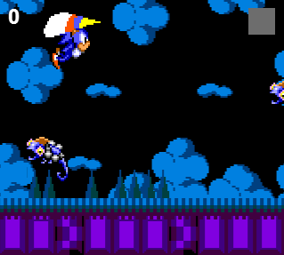

# flappyBirdClone

#### A Flappy Bird clone written using CreateJS, RequireJS, whenjs, underscore, and Radio.js

---

Yeah, there are a lot of Flappy Bird clones out there. Tutorials and examples abound. However, I'm
hoping this example project will showcase some modern best practices for game development, utilizing
some cool techniques and libraries while still being easy to understand.

The source material and original inspiration for this sample was gleaned from Jose Ignacio Amelivia at:

http://namelivia.com/how-to-create-a-flappy-bird-clone/

https://github.com/namelivia/flappysonic

He's constantly updating his repo, so it's probably a good idea to check it out and see how he's
accomplished some of the same things I have, but using different tactics.

---

#### Best Practices and Goals

- Utilize a module loader. It's inexcusable to NOT use one in this day and age. We'll use RequireJS for
this purpose.

- Separate concerns. Scenes should instantiate objects and control non-interactive scenery, but interactive
elements should handle themselves and interact in a decoupled manner. This is where Radio.js as a pubsub
aggregator comes in.

- Minimize use of one-off boolean flags. It becomes messy to keep track of flags on objects all over the
place. By more cleverly utilizing singleton-styled methods and other structures provided by underscore,
we can reduce the number of these flags while still making our code easily readable.

- Use deferreds. Chain methods as needed to create proper execution flow in our program; we want to clearly
define what needs to occur before the program can continue executing.

- Keep it in the canvas! In preparation for a migration to CocoonJS or another mobile execution
environment, we want to completely eliminate any DOM elements from the game. Every UI element and game
object should be contained within the canvas stage.